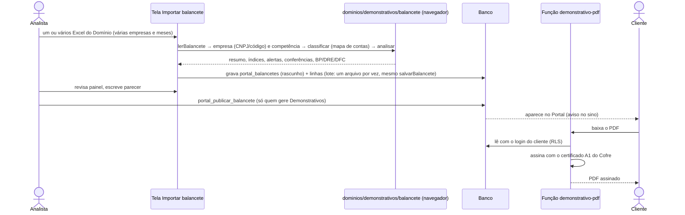
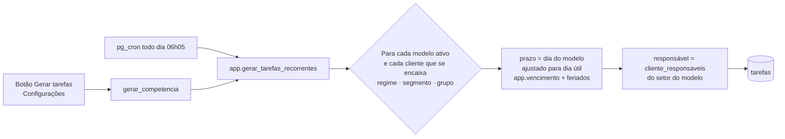
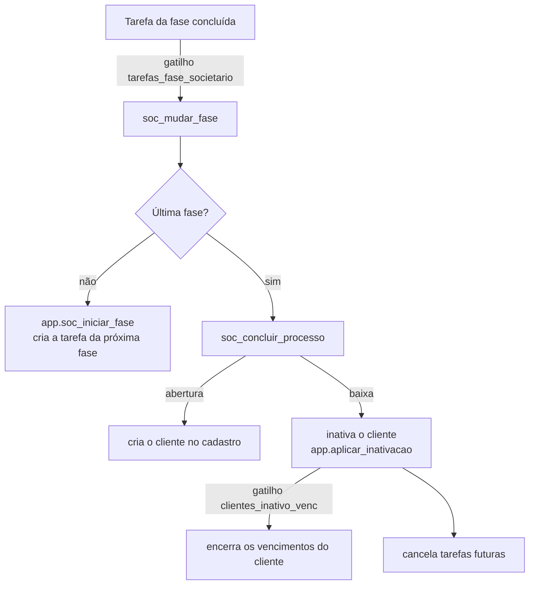

# 6. Fluxos importantes

> **Resumo:** quatro fluxos concentram quase toda a regra de negócio: o balancete (Demonstrativos → Portal),
> as tarefas recorrentes do mês, o Societário (que cria tarefas e mexe em clientes) e o Atendimento.
> Muitas coisas acontecem **sozinhas no banco** (gatilhos e agendador); o mapa da seção 6.4 mostra todas.

## 6.1 Balancete: do Excel do Domínio ao Portal do cliente

```mermaid
sequenceDiagram
    actor A as Analista
    participant T as Tela Importar balancete
    participant L as dominios/demonstrativos/balancete (navegador)
    participant DB as Banco
    participant EF as Função demonstrativo-pdf
    actor C as Cliente
    A->>T: um ou vários Excel do Domínio (várias empresas e meses)
    T->>L: lerBalancete → empresa (CNPJ/código) e competência → classificar (mapa de contas) → analisar
    L-->>T: resumo, índices, alertas, conferências, BP/DRE/DFC
    T->>DB: grava portal_balancetes (rascunho) + linhas (lote: um arquivo por vez, mesmo salvarBalancete)
    A->>T: revisa painel, escreve parecer
    A->>DB: portal_publicar_balancete (só quem gere Demonstrativos)
    DB-->>C: aparece no Portal (aviso no sino)
    C->>EF: baixa o PDF
    EF->>DB: lê com o login do cliente (RLS)
    EF->>EF: assina com o certificado A1 do Cofre
    EF-->>C: PDF assinado
```

Regras: no lote, arquivo de mês já publicado fica de fora (precisa despublicar) e rascunho existente só é trocado
quando marcado "Substituir"; o resumo por empresa sai em PDF e Excel. Na análise e no Portal, o período (mês,
trimestre, semestre ou ano do calendário) é escolhido no topo e agrega os balancetes no navegador; o "Baixar PDF"
segue esse período e o servidor refaz o cálculo só com meses publicados: assina só período completo, período que só
falta o fim sai parcial e sem assinatura, e mês faltando no meio bloqueia o PDF. A importação (um arquivo ou lote) e o
"Reprocessar" gravam cabeçalho, cálculo e contas numa transação só (`portal_gravar_balancete`, `portal_regravar_contas`). Detalhes em [modulos/demonstrativos.md](modulos/demonstrativos.md).

Balancete publicado e suas linhas não mudam (gatilhos `publicacao_protegida` e
`linhas_balancete_protegidas`); para corrigir, despublique, ajuste e publique de novo.

## 6.2 Tarefas recorrentes do mês

```mermaid
flowchart LR
    CRON[pg_cron todo dia 06h05] --> G[app.gerar_tarefas_recorrentes]
    BOT[Botão Gerar tarefas<br/>Configurações] --> GC[gerar_competencia]
    GC --> G
    G --> M{Para cada modelo ativo<br/>e cada cliente que se encaixa<br/>regime · segmento · grupo}
    M --> P[prazo = dia do modelo<br/>ajustado para dia útil<br/>app.vencimento + feriados]
    P --> R[responsável = cliente_responsaveis<br/>do setor do modelo]
    R --> T[(tarefas)]
```

É idempotente: rodar de novo para a mesma competência não duplica tarefas.

## 6.3 Societário: uma tarefa concluída avança o processo

```mermaid
flowchart TB
    A[Tarefa da fase concluída] -->|gatilho tarefas_fase_societario| B[soc_mudar_fase]
    B --> C{Última fase?}
    C -- não --> D[app.soc_iniciar_fase<br/>cria a tarefa da próxima fase]
    C -- sim --> E[soc_concluir_processo]
    E -->|abertura| F[cria o cliente no cadastro]
    E -->|baixa| G[inativa o cliente<br/>app.aplicar_inativacao]
    G -->|gatilho clientes_inativo_venc| H[encerra os vencimentos do cliente]
    G --> I[cancela tarefas futuras]
```

Concluir uma **baixa** (que inativa o cliente) é só para gestor ou administrador.

**Empresa ainda não cadastrada** (ex.: chega à MDC já precisando de alteração contratual): no "Novo processo", em
Cliente, escolha "Empresa ainda não cadastrada no HUB" e informe razão social, CNPJ e UF. O processo anda normalmente.
Quando um gestor cadastrar a empresa em Tarefas › Configurações › Clientes, a ficha do processo oferece **Ligar ao
cliente** (`soc_vincular_cliente`, migração 037): o processo e as tarefas das fases passam para o cliente, com registro
no histórico e na auditoria. Na abertura nada muda: concluir o processo cadastra a empresa sozinho.

## 6.4 Mapa de automações (o que acontece sem ninguém clicar)

| Gatilho ou agenda | Quando | O que faz |
| --- | --- | --- |
| pg_cron `gerar-tarefas-recorrentes` | Todo dia 06h05 | Gera as tarefas do mês |
| pg_cron `avisar-vencimentos` → `app.venc_avisar` | Todo dia 06h15 | Avisos de vencimento 60/30/7 dias no sino |
| pg_cron `licencas-diaria` → `app.lic_rotina_diaria` | Todo dia 06h25 | Encerra contratos de licença com prazo vencido, gera as mensalidades do mês (sem duplicar) e, uma vez por dia, avisa no sino (administradores e quem tem Licenças) das mensalidades que venceram ontem e dos clientes que chegaram aos dias de atraso em que o HUB sugere bloquear. Bloquear é manual |
| `organizacoes_semear_licencas` | Organização criada | Cadastra os módulos vendáveis e o plano Gestão completa (preço zero) |
| `tarefas_historico` | Toda mudança de tarefa | Grava o histórico |
| `tarefas_fase_societario` | Tarefa de fase concluída | Avança o processo societário |
| `clientes_inativo_venc` | Cliente inativado | Encerra os vencimentos dele |
| `crm_op_etapa` | Oportunidade muda de etapa | Registra a data da etapa |
| `membros_perfil`, `hub_perfis_propagar` | Perfil trocado ou editado | Regrava os acessos da pessoa |
| `aplicar_convites`, `aplicar_convites_portal` | Conta criada pelo convite | Liga a conta à organização ou ao cliente |
| `portal_usuario_nao_equipe` | Acesso de portal criado ou mudado | Impede equipe como usuário do portal e audita |
| pg_cron `agente-balancetes` → Função `balancete-agente` | A cada 15 min, só com a pasta ligada em Configurações › Integrações | Lê a pasta de balancetes do SharePoint, cria rascunhos, move os arquivos e registra em `hub_importacoes` |
| pg_cron `fiscal-captura` → Função `fiscal-captura` | A cada 15 min, só se houver empresa com captura ligada e certificado válido | Para cada empresa liberada: Distribuição DF-e da SEFAZ (NF-e, respeitando 137/656 e 1 hora de espera), ciência automática nos resumos, ADN da NFS-e; grava XML no bucket `fiscal` e as notas/eventos ([fluxo](modulos/notas-fiscais.md#4-fluxos)) |
| Simulador (projeto separado) → `crm_receber_lead` | Lead preenchido no site | Cria a oportunidade no CRM |
| `fin_conta_bancaria_valida`, `fin_categoria_valida`, `fin_titulo_valida`, `est_item_valida` | Gravação de conta bancária, categoria, título ou item | Confere empresa, conta analítica ativa do plano, tipo da categoria x tipo do título, travas de situação do título e de item com saldo |
| `sem_troca_empresa`, `cliente_mesma_org` (tabelas `fin_*` e `est_*`) | Cadastro do Financeiro/estoque alterado | Impede mudar de empresa ou de organização |
| `fin_auditar` | Conta bancária, fornecedor/cliente, categoria, centro de custo, título, item, grupo de produto ou estoque criado/alterado direto pela tela | Registra antes e depois na auditoria (as funções `fin_*`/`est_*` registram o próprio evento) |
| `app.est_recalcular` (chamado por `app.est_gravar` e pelos estornos) | Todo movimento de estoque gravado ou estornado | Recalcula a ficha do item (saldo e custo médio depois de cada movimento) e o custo médio do cadastro |
| `est_pedido_confirmar` / `est_pedido_receber` → `app.est_pedido_lancar` | Venda confirmada / compra recebida | Baixa ou dá entrada no estoque dos itens estocáveis e cria uma conta a receber/pagar por parcela (`fin_lancar`) |
| `est_pedido_cancelar` | Pedido cancelado | Estorna os movimentos do pedido e cancela as parcelas em aberto |

## 6.5 Atendimento: conversa vira tarefa

O cliente abre uma conversa no Portal (`portal_abrir_conversa`); a equipe responde em `/atendimento`. Se o pedido
der trabalho, o botão "virar tarefa" chama `portal_conversa_para_tarefa`, que cria a tarefa ligada à conversa e
avisa o cliente com uma mensagem de sistema.

Telas (molde 8.3.1, desde 02/11/2026): `/atendimento` tem indicadores que filtram (novas, resposta atrasada, minhas),
filtros de busca/situação/assunto e PDF/Excel da lista. A lista e a conversa usam a mesma moldura do "Fale com a MDC"
do Portal (`dominios/atendimento/componentes/PainelConversas`): no computador ficam lado a lado; no celular aparece uma
de cada vez, com o botão "Voltar". Nova conversa (equipe ou cliente) abre na janela `NovaConversa`.
